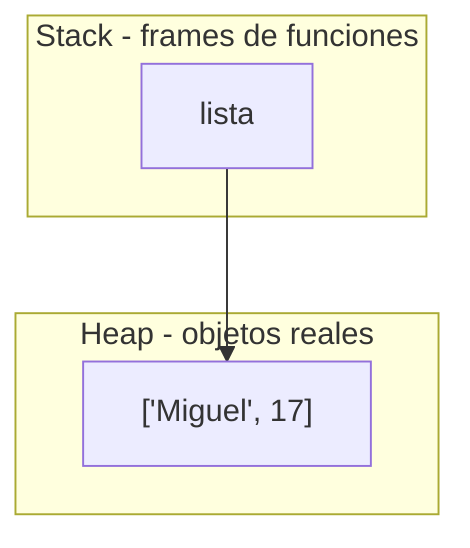
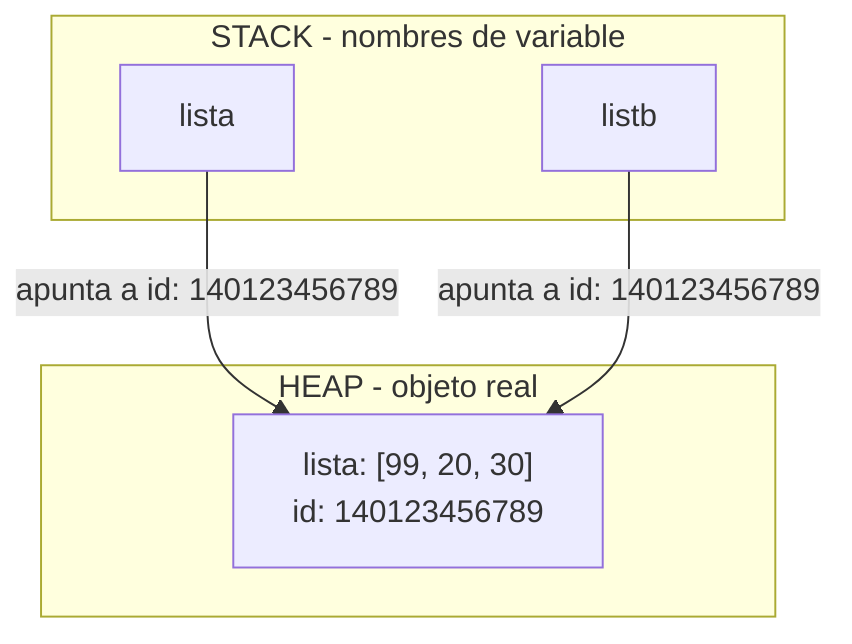

# Listas en Python

## Fundamentos de listas/arreglos

### Definicion de lista y caracteristicas

Las listas son un recurso de organizacion para guardar multiples datos dentro de una variable que es un tipo lista. Las listas en Python son estructuras de datos ordenadas y mutables que permiten almacenar múltiples valores de cualquier tipo en una sola variable.

Las listas en python son mutables es decir que se pueden editar sus valores originales dentro de una funcion, python hace un **Call by object reference** que es una llamada (puntero) de referencia de memorias
en donde en vez de crear una instancia/objeto nuevo lo que se hace en una modificacion especifica a ese objeto que vive en ese espacio de memoria asignado.

En Python, absolutamente todos los objetos (listas, strings, ints, diccionarios, todo) se 
crean y viven en el heap. Esto es diferente a lenguajes como C, donde una variable local simple puede vivir en el stack.

El tamaño de una lista en python es un limite teorico ya que solamente se puede definir con las interacciones que el usuario haga con las listas a traves de metodos o funciones, al ser las listas un elemento mutable es muy importante tener en cuenta eso en python.

- **Límite teórico**

    En sistemas de 64 bits es de 2⁶³ - 1 elementos (aproximadamente 9.22 × 10¹⁸ ítems) y en sistemas de 32 bits es de 2³¹ - 1 (cerca de 2.1 × 10⁹ elementos). osea la capacidad de memoria que pudiera ocupar.
        
- **Límite práctico**

    En la realidad, tu computadora se quedará sin memoria RAM y arrojará un error de tipo 'MemoryError' mucho antes de alcanzar ese número máximo de índices. 

Listas dinámicas, mutabilidad y Referencias

Las listas en python son mutables es decir que se pueden editar sus valores originales dentro de una funcion, python hace un **Call by object reference** que es una llamada (puntero) de referencia de memorias
en donde en vez de crear una instancia/objeto nuevo lo que se hace en una modificacion especifica a ese objeto que vive en ese espacio de memoria asignado.

En Python, absolutamente todos los objetos (listas, strings, ints, diccionarios, todo) se 
crean y viven en el heap. Esto es diferente a lenguajes como C, donde una variable local simple puede vivir en el stack.



### Como definir una lista 
La forma general sugiere definir el nombre de la lista con su atributo list acompañado de llaves "[]" le asignamos (=) una lista osea las llaves *(las llaves son exclusivas de las listas)*.

    nombre_lista: list[TIPO_A | TIPO_B] = [elemento1, elemento2]

```python
numeros:list[int] = [5,7,8,10]
nombres:list[str] = ["Miguel","Vanessa","Eduardo","Jose"]
precios: list[float] = [12.32, 3.1416, 78.0, 98.0, 0.99]

```

## Tipos de listas 

Las listas pueden recibir varios tipos de datos en sus listas inclusive otras listas u otras estructuras de datos como tuplas(), conjuntos{} diccionarios{:} e incluso otra listas[] a ese caso se le llama **ArrayList (Listas de Listas *se ocupan para matrizes*)**

1. **Listas Homogeneas**

    En Python, una lista homogénea es aquella que contiene elementos del mismo tipo de datos (por ejemplo, una lista que contiene únicamente números enteros, o únicamente cadenas de texto).
    
    Aunque Python no obliga a que las listas tengan el mismo tipo de datos debido a su naturaleza dinámica, las listas homogéneas son el estándar en la práctica cuando se realizan operaciones repetitivas sobre colecciones de datos.

```python

edades:list[int] = [25, 30, 18, 42]
frutas:list[str] = ["manzana", "banana", "cereza"]
```

2. **Listas Heterogeneras**

    En Python, una **lista heterogénea** es aquella que contiene elementos de diferentes tipos de datos *(como enteros, cadenas de texto, booleanos, flotantes e incluso otras listas)* dentro de una misma estructura.
    
    A diferencia de otros lenguajes de programación donde los arreglos exigen que todos los elementos sean del mismo tipo, las listas de Python son flexibles por defecto debido a que el lenguaje maneja un tipado dinámico.

```python
usuario:list[ int | str | bool ] = [
        
        1, "Carlos", 28, True

    ] 
```

> [!IMPORTANT]
    > Las listas echas de tipo 'List[dic(str:Any)]' son listas Homogeneas ya que contine dos tipos de datos en su definicion.

3.  **lista anidada (ArrayList or Matriz)**
   
    En Python, una lista anidada es simplemente una lista que contiene otras listas como elementos. Esto permite estructurar datos en forma de tablas, coordenadas o matrices matemáticas.


```python
matriz: list[list[int]] = [

    [1,0,0],
    [0,1,0],
    [0,0,1]
]
```

## Memoria

Antes de entrar de lleno en la memoria de listas es bueno tener en claro las funciones de cada componente que hace que el metodo de almacenamiento funcione en python. Como vimos anteriormente en listas el Call by object reference es un concepto clave que manda la referencia del objeto aqui nace la pregunta... ¿De donde viene esa referencia?.

- Stack(pila): guarda los nombres (punteros) de cada función activa.
- Heap(monticulo): guarda los objetos reales a los que esos nombres apuntan.
- Variable: es solo una etiqueta/nombre que apunta hacia un objeto en memoria.
- Apuntador(referencia): es justamente esa flecha invisible que conecta el nombre de la variable con la dirección de memoria donde vive el objeto real.
- id: es la dirección de memoria (en CPython, literalmente la dirección del objeto en el heap)
- valor: es el contenido real del objeto, almacenado en el heap.

El nombre de la lista en python como tal se guarda en el Stack, y el objeto al que apunta vive en el heap al ser un objeto, su direccion de memoria (id) es la que vive en el heap y es a la que apunta el nombre desde el Stack.

Es importante entender que una lista en Python no almacena los valores directamente dentro de si misma, lo que guarda es un arreglo de apuntadores/referencias hacia otros objetos que tambien viven por separado en el heap. 

Es decir, cada casilla de la lista apunta hacia otro objeto (un numero, un string, otra lista, un diccionario) y ese objeto ocupa su propio espacio de memoria en el heap. Por eso cuando una lista contiene otra lista o un diccionario, lo que existe en realidad es una cadena de referencias: la variable en el Stack apunta a la lista principal en el Heap, y esa lista principal a su vez apunta a otros objetos en el Heap, y asi sucesivamente. Esto explica por que la mutabilidad se propaga en cascada, si un mismo objeto (por ejemplo un diccionario anidado) es apuntado por dos referencias distintas, modificarlo desde una de ellas tambien se refleja en la otra, ya que ambas apuntan al mismo id, al mismo objeto dentro del heap.

La memoria de listas en python como ya mencionamos tiene un limite teorico de capacidad de una lista que es de 2⁶³ - 1 elementos para sistemas de x64 bits, y las variables viven en el stack, que es una pila de llamadas donde viven los nombres, y las listas (los objetos) viven en el heap.

El id identifica el espacio de memoria asignado a esa instancia de objeto, en este caso la lista que vive en el heap, y devuelve un numero que en la implementación estándar de Python (CPython), este número entero corresponde directamente a la dirección de memoria RAM en el Heap donde está almacenado dicho objeto.

```python

lista:list[int] = [0,1,2,3,4,5,6,7]

def saber_direc(objeto = None):

    if objeto == None:
        print("Se espera un arguemnto de entrada")
        return
    
    print(id(objeto))
    direccion_dec = id(objeto)
    return
```

### Identificadores en decimal, hexadecimal y binario

Por defecto python retorna el valor de id de direccion de memoria de cualquier objeto en decimal con las funciones hex y bin podemos retornar un valor disntinto.


```python

    lista:list[int] = [0,1,2,3,4,5,6,7]

    print(hex(id(lista)))
    print(bin(id(lista)))

```

De esa mamera de convierte el valor decimal de la lista un hexa-decimal o binario

### Apuntadores

Al asignar el valor de una lista o de un dato a otra lista realmente esta apuntando al mismo espacio de memoria que pasa aca, lo mismo que a estado pasando con la mutabilidad de las listas el **call object by reference**.

```python 
lista = [10, 20, 30]
listb = lista  

listb[0] = 99  
print(lista)

print (id(lista) == id(listb))

```
No se creó una lista nueva. lista y listb tienen el mismo ID de memoria . Al cambiar un elemento, el cambio se refleja en ambas porque comparten el mismo apuntador.




## Acceso y indices

### Índices

- indices

En python los indices de una lista son un referencia numerica asignada a un elemento empezando desde 0 no desde 1. En esa posicion es el indice, veamoslo con un ejemplo anterior.

> [!WARNING]  
    > Tener encuenta no se puden ingresar valores decimales a en el indice esperado debe ser si o si un int 

> [!WARNING]  
 > Tambien hay que tener en cuenta que si se ingresa un valor fuera de rango enviara un error `IndexError: list index out of range`. El rango valido de indices es de -n a n - 1, siendo n la cantidad de elementos que tengamos en la lista. Es decir, los indices positivos van de 0 a n - 1, y los indices negativos van de -n a -1.

```Python

frutas = ["manzana", "banana", "cereza", "durazno"]
#            0          1          2         3

```
- Índices positivos: 

Cuentan desde el inicio hacia la derecha, empezando en 0

```Python
print(frutas[0])   # "manzana"  → primer elemento
print(frutas[2])   # "cereza"
```
- Índices negativos:

Python permite contar desde el final hacia la izquierda, empezando en -1 (no en -0, porque 0 ya está tomado por el primer elemento).

```Python
print(frutas[-1])   # "durazno"  → último elemento
print(frutas[-2])   # "cereza"   → penúltimo
```
Esto es muy práctico cuando no sabés (o no querés calcular) el tamaño de la lista pero necesitás el último elemento — evitás hacer frutas[len(frutas) - 1].

### Acceso y modificacion

- Acceso a elementos:

Se hace con el operador [] seguido del índice aca lo que se hace es crear una instacia de valor y se asigna el valor en esa posicion de esa lista:

```Python
nombre = frutas[1]
print(nombre)   # "banana"
```
- Modificación de elementos:

Como las listas son mutables, podés reasignar el valor de una posición específica sin crear una lista nueva(esto conecta directo con lo que ya vimos de referencias — el id de la lista no cambia):

```Python
frutas[0] = "kiwi"
print(frutas)          # ['kiwi', 'banana', 'cereza', 'durazno']
print(id(frutas))      # el mismo id de antes, no se creó objeto nuevo
```


## Métodos de listas

### Agregar elementos

- `append()`
- `insert()`
- `extend()`

### Eliminar elementos

- `remove()`
- `pop()`
- `clear()`
- `del`

### Buscar y contar

- `index()`
- `count()`
- `len()`
- `in`
- `not in`

### Ordenar y modificar

- `sort()`
- `reverse()`

### Copiar

- `copy()`

## 4. Operaciones con listas

- Concatenación `+`
- Repetición `*`
- Comparación de listas
- Asignación
- Referencias
- Copias
- Desempaquetado
- Desempaquetado extendido

## 5. Recorridos

- Recorrido con `for`
- Recorrido con `while`
- Recorrido por elementos
- Recorrido por índices
- `range()`
- `enumerate()`

## 6. Slicing

- `[inicio:fin]`
- `[inicio:fin:paso]`
- Slicing desde el inicio
- Slicing hasta el final
- Slicing con índices negativos
- `[::-1]`
- Modificación mediante slicing

## 7. Listas anidadas

- Concepto de listas anidadas
- Listas dentro de listas
- Acceso a elementos
- Modificación de elementos
- Recorridos anidados
- Matrices
- Filas y columnas

## 8. Listas y otras estructuras

### Listas + Tuplas

- Listas de tuplas
- Conversión entre listas y tuplas

### Listas + Conjuntos

- Listas y conjuntos
- Conversión entre listas y conjuntos

### Listas + Diccionarios

- Listas de diccionarios
- Diccionarios con listas
- Acceso a estructuras combinadas

## 9. Listas y funciones

- Listas como argumentos
- Listas como parámetros
- Retornar listas
- Modificar listas dentro de funciones
- Funciones que procesan listas
- Funciones que generan listas

## 10. Ejercicios

- Ejercicios de conceptos
- Ejercicios de creación
- Ejercicios de índices
- Ejercicios de modificación
- Ejercicios de métodos
- Ejercicios de recorridos
- Ejercicios de slicing
- Ejercicios de listas anidadas
- Ejercicios combinando listas con otras estructuras
- Ejercicios integradores