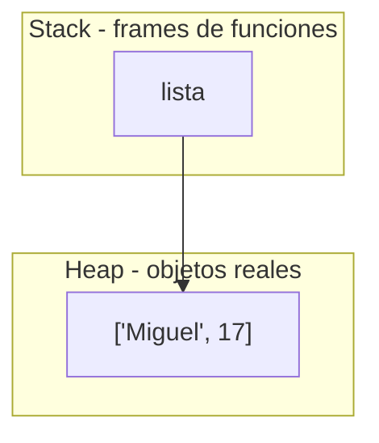
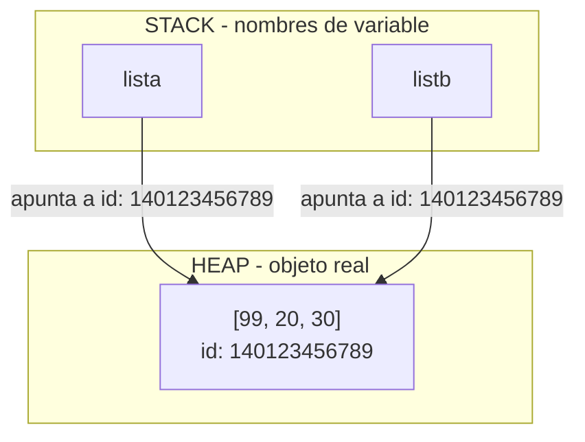

# Listas en Python

## Fundamentos de listas/arreglos

### Definicion de lista y caracteristicas

Las listas son un recurso de organizacion para guardar multiples datos dentro de una variable que es un tipo lista. Las listas en Python son estructuras de datos ordenadas y mutables que permiten almacenar múltiples valores de cualquier tipo en una sola variable.

Las listas en python son mutables es decir que se pueden editar sus valores originales dentro de una funcion, python hace un **Call by object reference** que es una llamada (puntero) de referencia de memorias
en donde en vez de crear una instancia/objeto nuevo lo que se hace en una modificacion especifica a ese objeto que vive en ese espacio de memoria asignado.

En Python, absolutamente todos los objetos (listas, strings, ints, diccionarios, todo) se 
crean y viven en el heap. Esto es diferente a lenguajes como C, donde una variable local simple puede vivir en el stack.

El tamaño de una lista en python es un limite teorico ya que solamente se puede definir con las interacciones que el usuario haga con las listas a traves de metodos o funciones, al ser las listas un elemento mutable es muy importante tener en cuenta eso en python.

- **Límite teórico**

    En sistemas de 64 bits es de 2⁶³ - 1 elementos (aproximadamente 9.22 × 10¹⁸ ítems) y en sistemas de 32 bits es de 2³¹ - 1 (cerca de 2.1 × 10⁹ elementos). osea la capacidad de memoria que pudiera ocupar.
        
- **Límite práctico**

    En la realidad, tu computadora se quedará sin memoria RAM y arrojará un error de tipo 'MemoryError' mucho antes de alcanzar ese número máximo de índices. 

Listas dinámicas, mutabilidad y Referencias

Las listas en python son mutables es decir que se pueden editar sus valores originales dentro de una funcion, python hace un **Call by object reference** que es una llamada (puntero) de referencia de memorias
en donde en vez de crear una instancia/objeto nuevo lo que se hace en una modificacion especifica a ese objeto que vive en ese espacio de memoria asignado.

En Python, absolutamente todos los objetos (listas, strings, ints, diccionarios, todo) se 
crean y viven en el heap. Esto es diferente a lenguajes como C, donde una variable local simple puede vivir en el stack.



### Como definir una lista 
La forma general sugiere definir el nombre de la lista con su atributo list acompañado de llaves "[]" le asignamos (=) una lista osea las llaves *(las llaves son exclusivas de las listas)*.

    nombre_lista: list[TIPO_A | TIPO_B] = [elemento1, elemento2]

```python
numeros:list[int] = [5,7,8,10]
nombres:list[str] = ["Miguel","Vanessa","Eduardo","Jose"]
precios: list[float] = [12.32, 3.1416, 78.0, 98.0, 0.99]

```

## Tipos de listas 

Las listas pueden recibir varios tipos de datos en sus listas inclusive otras listas u otras estructuras de datos como tuplas(), conjuntos{} diccionarios{:} e incluso otra listas[] a ese caso se le llama **ArrayList (Listas de Listas *se ocupan para matrizes*)**

1. **Listas Homogeneas**

    En Python, una lista homogénea es aquella que contiene elementos del mismo tipo de datos (por ejemplo, una lista que contiene únicamente números enteros, o únicamente cadenas de texto).
    
    Aunque Python no obliga a que las listas tengan el mismo tipo de datos debido a su naturaleza dinámica, las listas homogéneas son el estándar en la práctica cuando se realizan operaciones repetitivas sobre colecciones de datos.

```python

edades:list[int] = [25, 30, 18, 42]
frutas:list[str] = ["manzana", "banana", "cereza"]
```

2. **Listas Heterogeneras**

    En Python, una **lista heterogénea** es aquella que contiene elementos de diferentes tipos de datos *(como enteros, cadenas de texto, booleanos, flotantes e incluso otras listas)* dentro de una misma estructura.
    
    A diferencia de otros lenguajes de programación donde los arreglos exigen que todos los elementos sean del mismo tipo, las listas de Python son flexibles por defecto debido a que el lenguaje maneja un tipado dinámico.

```python
usuario:list[ int | str | bool ] = [
        
        1, "Carlos", 28, True

    ] 
```

> [!IMPORTANT]
> Las listas echas de tipo 'List[dic(str:Any)]' son listas Homogeneas ya que contine dos tipos de datos en su definicion.

3.  **lista anidada (ArrayList or Matriz)**
   
    En Python, una lista anidada es simplemente una lista que contiene otras listas como elementos. Esto permite estructurar datos en forma de tablas, coordenadas o matrices matemáticas.


```python
matriz: list[list[int]] = [

    [1,0,0],
    [0,1,0],
    [0,0,1]
]
```

## Memoria

Antes de entrar de lleno en la memoria de listas es bueno tener en claro las funciones de cada componente que hace que el metodo de almacenamiento funcione en python. Como vimos anteriormente en listas el Call by object reference es un concepto clave que manda la referencia del objeto aqui nace la pregunta... ¿De donde viene esa referencia?.

- Stack(pila): guarda los nombres (punteros) de cada función activa.
- Heap(monticulo): guarda los objetos reales a los que esos nombres apuntan.
- Variable: es solo una etiqueta/nombre que apunta hacia un objeto en memoria.
- Apuntador(referencia): es justamente esa flecha invisible que conecta el nombre de la variable con la dirección de memoria donde vive el objeto real.
- id: es la dirección de memoria (en CPython, literalmente la dirección del objeto en el heap)
- valor: es el contenido real del objeto, almacenado en el heap.

El nombre de la lista en python como tal se guarda en el Stack, y el objeto al que apunta vive en el heap al ser un objeto, su direccion de memoria (id) es la que vive en el heap y es a la que apunta el nombre desde el Stack.

Es importante entender que una lista en Python no almacena los valores directamente dentro de si misma, lo que guarda es un arreglo de apuntadores/referencias hacia otros objetos que tambien viven por separado en el heap. 

Es decir, cada casilla de la lista apunta hacia otro objeto (un numero, un string, otra lista, un diccionario) y ese objeto ocupa su propio espacio de memoria en el heap. Por eso cuando una lista contiene otra lista o un diccionario, lo que existe en realidad es una cadena de referencias: la variable en el Stack apunta a la lista principal en el Heap, y esa lista principal a su vez apunta a otros objetos en el Heap, y asi sucesivamente. Esto explica por que la mutabilidad se propaga en cascada, si un mismo objeto (por ejemplo un diccionario anidado) es apuntado por dos referencias distintas, modificarlo desde una de ellas tambien se refleja en la otra, ya que ambas apuntan al mismo id, al mismo objeto dentro del heap.

La memoria de listas en python como ya mencionamos tiene un limite teorico de capacidad de una lista que es de 2⁶³ - 1 elementos para sistemas de x64 bits, y las variables viven en el stack, que es una pila de llamadas donde viven los nombres, y las listas (los objetos) viven en el heap.

El id identifica el espacio de memoria asignado a esa instancia de objeto, en este caso la lista que vive en el heap, y devuelve un numero que en la implementación estándar de Python (CPython), este número entero corresponde directamente a la dirección de memoria RAM en el Heap donde está almacenado dicho objeto.

```python

lista:list[int] = [0,1,2,3,4,5,6,7]

def saber_direc(objeto = None):

    if objeto == None:
        print("Se espera un arguemnto de entrada")
        return
    
    print(id(objeto))
    direccion_dec = id(objeto)
    return
```

### Identificadores en decimal, hexadecimal y binario

Por defecto python retorna el valor de id de direccion de memoria de cualquier objeto en decimal con las funciones hex y bin podemos retornar un valor disntinto.


```python
lista:list[int] = [0,1,2,3,4,5,6,7]

print(hex(id(lista)))
print(bin(id(lista)))
```

De esa mamera de convierte el valor decimal de la lista un hexa-decimal o binario

### Apuntadores

Al asignar el valor de una lista o de un dato a otra lista realmente esta apuntando al mismo espacio de memoria que pasa aca, lo mismo que a estado pasando con la mutabilidad de las listas el **call object by reference**.

```python 
lista = [10, 20, 30]
listb = lista  

listb[0] = 99  
print(lista)

print (id(lista) == id(listb))

```
No se creó una lista nueva. lista y listb tienen el mismo ID de memoria . Al cambiar un elemento, el cambio se refleja en ambas porque comparten el mismo apuntador.




## Acceso y indices

### Índices

- indices

En python los indices de una lista son un referencia numerica asignada a un elemento empezando desde 0 no desde 1. En esa posicion es el indice, veamoslo con un ejemplo anterior.

> [!WARNING]
> Tener encuenta no se puden ingresar valores decimales a en el indice esperado debe ser si o si un int 

> [!WARNING]
> Tambien hay que tener en cuenta que si se ingresa un valor fuera de rango enviara un error `IndexError: list index out of range`. El rango valido de indices es de -n a n - 1, siendo n la cantidad de elementos que tengamos en la lista. Es decir, los indices positivos van de 0 a n - 1, y los indices negativos van de -n a -1.

```python

frutas = ["manzana", "banana", "cereza", "durazno"]
#            0          1          2         3

```

#### Índices positivos

Cuentan desde el inicio hacia la derecha, empezando en 0

```python
print(frutas[0])   # "manzana"  → primer elemento
print(frutas[2])   # "cereza"
```

#### Índices negativos

Python permite contar desde el final hacia la izquierda, empezando en -1 (no en -0, porque 0 ya está tomado por el primer elemento).

```python
print(frutas[-1])   # "durazno"  → último elemento
print(frutas[-2])   # "cereza"   → penúltimo
```
Esto es muy práctico cuando no sabés (o no querés calcular) el tamaño de la lista pero necesitás el último elemento — evitás hacer frutas[len(frutas) - 1].

### Acceso y modificacion

#### Acceso a elementos

Se hace con el operador [] seguido del índice aca lo que se hace es crear una instacia de valor y se asigna el valor en esa posicion de esa lista:

```python
nombre = frutas[1]
print(nombre)   # "banana"
```

#### Modificación de elementos

Como las listas son mutables, podés reasignar el valor de una posición específica sin crear una lista nueva(esto conecta directo con lo que ya vimos de referencias — el id de la lista no cambia):

```python
frutas[0] = "kiwi"
print(frutas)          # ['kiwi', 'banana', 'cereza', 'durazno']
print(id(frutas))      # el mismo id de antes, no se creó objeto nuevo
```

## Métodos de listas

Los métodos de listas en Python modifican el Heap de la lista existente agregando una nueva referencia a este espacio sin necesidad de crear una nueva instancia. Estos métodos tienen la particularidad de recibir siempre un parámetro `self`, que no es más que la autoreferencia del objeto sobre el cual se está aplicando la función. A través de este `self`, el método reconoce la dirección de memoria en el Stack que apunta al objeto en el Heap, permitiendo realizar la modificación directamente en el sitio (in-place).

### Agregar elementos

> [!TIP]
> extend() = Suma los elementos internos del objeto al Heap.append() 
> insert() = Suman el objeto completo (como un contenedor cerrado) al Heap.

#### `append()`

El metodo append() agrega un nuevo elemento al final de la lista. El metodo como tal retorna None lo que hace en si no modifica ni crea una nueva memoria en el heap que vive la lista el solo agrega una nueva direccion de memoria de stack que vive en la lista osea el heap.

#### `insert()`

El insert() funciona bajo la misma logica de append busca un self de referenciay un objeto a hacer agregado pero aca pasa algo mas, el espera un argumento de indice y su parametro es un index el ubica al objeto en una posicion espesifica.

Si en caso que no se lleve a ingresar el argumento esperado el lanzara un TypeError de que espera 2 argumentos y solo se ingreso uno si en caso de ingresar un indece mucho mayor el siempre lo pondra al final de la lista.
y la continuidad sera normal

#### `extend()`

El extend() es un metodo para extender una lista con elemento iterable que significa no
acepta un metodo solo aislado tiene que ser una dict un conjunto una lista 
pero de manera iterable. Si se le ingresa un dato no iterable mandara un TypeError

### Eliminar elementos

#### `remove()`

El metodo remove funciona con el valor que se quiere el liminar se elimina de forma derecta en el stock y modifica a la lista original en el heap. El metodo remove toma el valor directo del la instancia del self al objeto que se este ocupando si el objeto toma una intancia de objeto de dato primitivo int este espera que sea un int igualmente si es un str o algun otro tipo de dato. 

El remove funciona con un call object by Reference para ayar la referncia a ese valor asu ves borrar el valor y su referencia
del stock no una referencia por lo que cuando tengamos un listas de referncias que viven el heap como dict o un ArrayList se tiene que pasar los datos especificos para borrarlos.

Cuando se ingresa un dato fuera de rango (elemnto que o valor que no se encuentra en la lista) manda un error de valor ya que no es un valor que se encuentre en la lista.

#### `pop()`

El método .pop() modifica la lista original directamente en el Heap,
eliminando la referencia que la lista tiene hacia ese objeto 
(y si ningún otro elemento apunta a él, el Garbage Collector liberará el valor de la memoria). 

A diferencia de .remove(), .pop() no espera un valor, sino un índice de tipo entero (int) que representa 
la posición en el Stack de la lista. Además, a diferencia de .remove(), .pop() 
tiene la cualidad de retornar (devolver) el objeto eliminado, 
permitiéndote guardarlo en otra variable si lo necesitas.

Si se ingresa un tipo de dato que no sea un entero (como un str o un dict), 
Python lanzará un TypeError porque el método exige un índice numérico válido.

Si se ingresa un índice que no existe (fuera de los límites de la lista), 
lanzará un IndexError (error de índice fuera de rango).

pop() elimina por defecto el último elemento de la lista (índice -1).

#### `clear()`

El método .clear() modifica la lista original directamente en el Heap, 
eliminando todas las referencias que la lista tiene hacia sus elementos/objetos de forma simultánea, 
sin importar el tipo de dato que almacene (ya sean primitivos o estructuras complejas).

A diferencia de 
.remove() o .pop(), este método no requiere ningún argumento (no recibe valores ni índices) 
y no genera errores de rango o tipo, ya que su única función es romper el vínculo entre la lista 
y todos los objetos a los que apuntaba.Tras ejecutar .clear(), la estructura de la lista permanece 
intacta en el Heap (mantiene su misma dirección de memoria o id()), pero queda completamente vacía. 

Los objetos que estaban dentro serán destruidos por el Garbage Collector 
(recolector de basura) solo si ninguna otra variable en el Stack sigue apuntando a ellos.

#### `del`

A diferencia de .remove(), .pop() o .clear(), del no es un método, 
sino una palabra clave (keyword) o instrucción nativa de Python. 

Su función principal no es borrar objetos directamente de la memoria, 
sino al objeto del namespace (frame local o globals()), 
y también opera sobre índices, slices, claves de dict y atributos.

del borra datos enteros de referncias a ese objeto mas que todo no 
elimina el objeto como tal si no la referncia de ese dato al heap de donde se este ocupando
en caso que esta no tenga mas referencias ella queda huerfana y Garbage Collector en CPython 
se liberan de inmediato al llegar el refcount a 0. El GC generacional solo limpia ciclos de referencias.

Si intentas usar la variable después de borrarla, Python lanzará un NameErro

### Buscar y contar

#### `index()`

.index() es un método de las listas en Python. Por defecto recorre la
lista buscando el valor que queremos y devuelve el índice (la posición)
de la primera coincidencia que encuentra, el recibe hasta 3 argumentos:

value: es obligatorio es el elemento a buscar
start: es opcional es la posición donde inicia la búsqueda
stop es opcional Posición donde se detiene (no incluida)

- Si el valor no está en la lista el lanzará un ValueError
- start como stop admiten números negativos (cuentan desde el final)
- La búsqueda siempre se realiza de izquierda a derecha

OJO: Si no defines el método especial de igualdad __eq__ 
en tu clase el index() comparará las direcciones de 
memoria reales en el Heap. Es decir solo encontrará el 
objeto exacto si pasas la misma referencia de variable 
pero fallará si creas un objeto nuevo con los mismos datos internos

#### `count()`

El método .count() recorre la lista completa elemento por elemento Compara 
cada posición mediante igualdad (==) con el valor que le pasamos.

Cuenta cuántas veces se repite un elemento con el mismo contenido en la lista y retorna la cantidad
Si el valor no se encuentra en ningún lado, devuelve 0
Si se llama vacío sin argumentos, lanzará un TypeError
Al comparar colecciones (como listas anidadas), evalúa el contenido exacto 

por ejemplo, [] no es igual a, ni el entero 2 es igual a la 

#### `len()`

En una lista trabajamos con elementos cada parte de la 
lista es un elementoal ocupar len() cuenta la cantidad 
de elementos que hay en la List sin importar el tipo.

La lista guarda apuntadores (referencias) a objetos que viven en el Heap 
Python obtiene directamente el conteo de estas referencias

#### `in`

'in' es un operador de membresía (pertenencia) que actúa como un filtro lógico 
devuelviendo un flag (True o False). Opera bajo las mismas reglas de comparación 
que .index() al buscar la referencia del objeto en el Heap usando el apuntador 
que viene desde el Stack.

- Si la condición de igualdad (__eq__) se cumple, devuelve True; de lo contrario, False
- Al devolver un booleano es muy común combinarlo con estructuras de control

El not in es un operador unico de membresia not solamente cambia o invierte la logica 
o la flag que de devuelve el operador.

### Ordenar y modificar

#### `sort()`

El metodo sort() odena la lista a nivel desendente o densendente esto no genera una nueva instancia,
modifica el orden de referencias de stock en el heap in-place.

El resive dos argumentos 

reverse: por defecto esta en false, sirve para odendenarla en orden inverso si esta en true
key: ecibe una función que transforma cada elemento antes de compararlo normalnte funciones lambda

Como al ser un metodo y no genera instancia este retorna None siempre

#### `reverse()`

El metodo reverse invierte el orden de la lista modifica la lista orginal no devuleve 
una lista nueva (in-place). No resive ningun parametro solamnete la referncia self 
de la lista.

### Copiar

#### `copy()`

El método .copy() realiza una COPIA SUPERFICIAL (shallow copy) de la lista:

- Genera una nueva lista en el Heap con un ID de memoria único.
- Duplica los apuntadores de los elementos de la lista original hacia la nueva.
- Para datos inmutables (int, str), actúan de forma independiente al modificarse.
- Para datos mutables anidados (listas, dicts), ambas listas comparten el mismo 
apuntador en el Heap, por lo que modificar el interior de uno alterará al otro.

## Operaciones con listas

#### Concatenación `+`

La concatenación es la combinación de dos o más listas mediante el operador +, creando una nueva instancia de lista. La nueva variable contiene una referencia al nuevo objeto creado en memoria. Las listas originales no son modificadas.

Al concocatenar las listas estas no se ordenan simplemete se añaden tal cual como estan y el resultado se asigna a una variable que contiene una referencia al nuevo objeto lista.

Tambien se puden hacer reacionaciones con el operador += que guarda la referncia al mismo objeto.

#### Repetición `*`

El operador * se conoce como repetición este operador funciona de la siguiente forma: 

    lista * n 

Siendo n un número entero es decir de tipo int 

- Si este número entero es negativo se genera una lista vacía ya que Python interpreta que debe realizar 0 
repeticiones mismo caso ocurre si se utiliza 0 como multiplicador 
- Si se ingresa un valor incorrecto, se generará un TypeError 

La lista que se genera es un nuevo objeto. La variable que recibe el resultado contiene una 
referencia hacia ese nuevo objeto

Se puede realizar una reasignación utilizando el operador *=: 

    lista *= n 

En este caso, la lista se modifica para repetir sus elementos n veces

Tambien duplicaciones de un elemto de la lista 

    lista[i] *= n

- Comparación de listas
- Asignación
- Referencias
- Copias
- Desempaquetado
- Desempaquetado extendido

## Recorridos

- Recorrido con `for`
- Recorrido con `while`
- Recorrido por elementos
- Recorrido por índices
- `range()`
- `enumerate()`

## Slicing

- `[inicio:fin]`
- `[inicio:fin:paso]`
- Slicing desde el inicio
- Slicing hasta el final
- Slicing con índices negativos
- `[::-1]`
- Modificación mediante slicing

## Listas anidadas

- Concepto de listas anidadas
- Listas dentro de listas
- Acceso a elementos
- Modificación de elementos
- Recorridos anidados
- Matrices
- Filas y columnas

## Listas y otras estructuras

### Listas + Tuplas

- Listas de tuplas
- Conversión entre listas y tuplas

### Listas + Conjuntos

- Listas y conjuntos
- Conversión entre listas y conjuntos

### Listas + Diccionarios

- Listas de diccionarios
- Diccionarios con listas
- Acceso a estructuras combinadas

## 9. Listas y funciones

- Listas como argumentos
- Listas como parámetros
- Retornar listas
- Modificar listas dentro de funciones
- Funciones que procesan listas
- Funciones que generan listas

## 10. Ejercicios

- Ejercicios de conceptos
- Ejercicios de creación
- Ejercicios de índices
- Ejercicios de modificación
- Ejercicios de métodos
- Ejercicios de recorridos
- Ejercicios de slicing
- Ejercicios de listas anidadas
- Ejercicios combinando listas con otras estructuras
- Ejercicios integradores